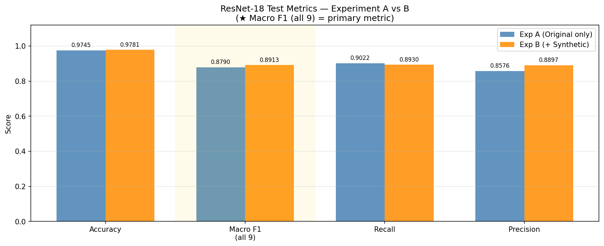
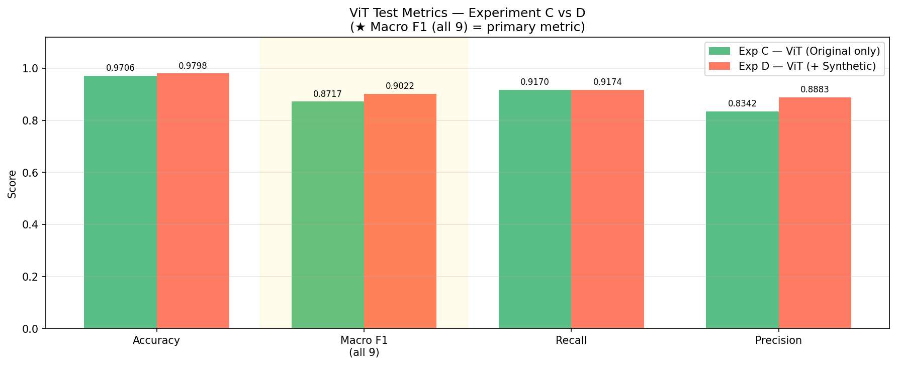
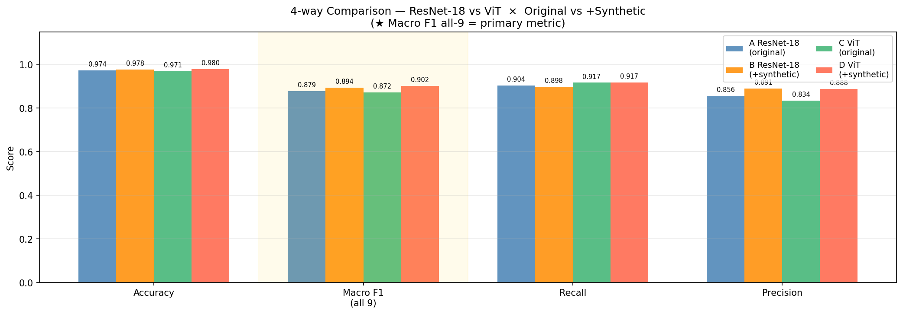
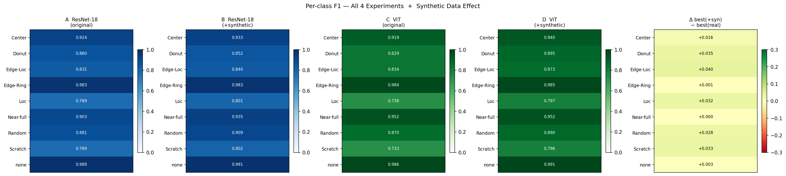

# Conditional Diffusion Model for Wafer Defect Map Synthesis

A class-conditional DDPM with Classifier-Free Guidance (CFG) trained on the **WM-811K** semiconductor wafer defect map dataset.  
The goal is to generate high-quality synthetic wafer maps for minority defect classes and evaluate whether synthetic augmentation improves downstream classification performance.

---

## Table of Contents

1. [Project Overview](#1-project-overview)
2. [Dataset](#2-dataset)
3. [Environment & Installation](#3-environment--installation)
4. [Project Structure](#4-project-structure)
5. [Model Architecture](#5-model-architecture)
6. [Training Strategy](#6-training-strategy)
7. [Synthetic Data Generation](#7-synthetic-data-generation)
8. [Downstream Classification Results](#8-downstream-classification-results)
9. [Key Findings](#9-key-findings)

---

## 1. Project Overview

Semiconductor wafer inspection produces binary defect maps where each die is labeled pass/fail. The WM-811K dataset suffers from severe **class imbalance** — the `none` (no-defect) class dominates while rare failure patterns (e.g., `Scratch`, `Loc`) have very few samples. This project addresses the imbalance by:

1. Training a **class-conditional diffusion model** (`ClassCondUNetV2`) to synthesise realistic wafer defect maps per class.
2. Augmenting the training set of downstream classifiers with the generated images.
3. Evaluating the effect via **four controlled experiments** (Exp A–D) using ResNet-18 and ViT-Small/16-224.

**Primary evaluation metric:** Macro F1 (all 9 classes).

---

## 2. Dataset

| Property        | Value                                                                         |
| --------------- | ----------------------------------------------------------------------------- |
| Source          | [WM-811K](https://www.kaggle.com/datasets/qingyi/wm811k-wafer-map)            |
| Total samples   | ~811,000 wafer maps                                                           |
| Image size      | 64 × 64 binary maps (pass/fail per die)                                       |
| Classes         | 9 (Center, Donut, Edge-Loc, Edge-Ring, Loc, Near-full, Random, Scratch, none) |
| Class imbalance | `none` ~76 k vs `Scratch` ~522 samples                                        |

The `none` class is filtered to the 25–75 percentile range (IQR) of the fail-die ratio to remove extreme outliers, then capped at `NONE_SAMPLE_CAP` before training the diffusion model.

---

## 3. Environment & Installation

> **This project was developed and run on Google Colab (GPU runtime).**  
> All notebooks are designed to be executed in a Colab environment. A local GPU with CUDA support is required for reproducing training runs.

### Colab Setup

```python
# Mount Google Drive (run at the top of each notebook)
from google.colab import drive
drive.mount('/content/drive')
```

### Install Dependencies

```bash
pip install -r requirements.txt
```

Key packages:

| Package        | Version  |
| -------------- | -------- |
| `torch`        | 2.10.0   |
| `torchvision`  | 0.25.0   |
| `timm`         | (latest) |
| `numpy`        | 2.0.2    |
| `scikit-learn` | 1.8.0    |
| `matplotlib`   | 3.10.8   |
| `pillow`       | 12.1.1   |
| `tqdm`         | 4.67.3   |

> The full `requirements.txt` was generated from the Colab environment via `pip freeze`. Some entries contain Conda build paths and are environment-specific — install only the packages above if setting up a fresh environment.

### Notebook Execution Order

```
01_Data_Transform.py          # Convert raw .mat → .npy
02_EDA.ipynb                  # Exploratory data analysis
03_Conditional_Diffusion.ipynb # Diffusion model training + downstream classification
```

---

## 4. Model Architecture

### ClassCondUNetV2

A class-conditional U-Net with the following enhancements over a vanilla ResUNet:

| Component                                | Description                                                                                                               |
| ---------------------------------------- | ------------------------------------------------------------------------------------------------------------------------- |
| **AdaGN** (Adaptive Group Normalization) | Dynamically modulates scale/shift of normalization layers using fused time + class embeddings for stronger conditioning   |
| **Self-Attention**                       | Captures global spatial dependencies within intermediate feature maps                                                     |
| **Cross-Attention (Class)**              | Allows spatial features to attend over multiple class context tokens (`CTX_TOKENS = 4`) expanded from the class embedding |
| **Zero-init output projections**         | Output projections of attention/residual blocks initialised to zero for training stability (identity mapping at t=0)      |

### Noise Schedule & Parameterisation

| Choice                    | Reason                                                                                  |
| ------------------------- | --------------------------------------------------------------------------------------- |
| **Cosine noise schedule** | Slower degradation at low timesteps preserves fine details (e.g., thin `Scratch` lines) |
| **V-parameterisation**    | Model predicts `v` instead of `ε`, improving reconstruction of high-frequency detail    |

---

## 5. Training Strategy

### Classifier-Free Guidance (CFG)

- **Training**: class label is randomly dropped with probability `p_uncond = 0.15`, forcing the model to also learn an unconditional distribution.
- **Sampling**: predictions are interpolated between conditional and unconditional outputs with guidance scale `w`:

  `ε̃ = εᵤ + w · (εc − εᵤ)`

### Contrastive Regularisation

A loss term that **penalises positive cosine similarity** between the `none` class embedding and all failure class embeddings, preventing the model from confusing `none` with subtle defect patterns.

### Sampler

**PLMS** (Pseudo-Linear Multi-step) with Adams-Bashforth multi-step correction — generates high-quality images in 50 steps instead of the full 1000-step DDPM chain.

---

## 6. Synthetic Data Generation

- **Target**: real + synthetic = **8,000 images** per failure class (`none` excluded — real data is sufficient).
- **Synthetic cap**: `real count × 3` per class — prevents rare classes from being overwhelmed by synthetic data in downstream training.

---

## 7. Downstream Classification Results

Four experiments measure the effect of synthetic augmentation on two model architectures:

| Exp   | Model                           | Training Data    |
| ----- | ------------------------------- | ---------------- |
| **A** | ResNet-18 (~11 M params)        | Real only        |
| **B** | ResNet-18                       | Real + Synthetic |
| **C** | ViT-Small/16-224 (~22 M params) | Real only        |
| **D** | ViT-Small/16-224                | Real + Synthetic |

Val Macro F1 is tracked per epoch; the best-epoch checkpoint is used for final test evaluation.

---

### 7.1 ResNet-18: Experiment A vs B



| Metric       | Exp A (real only) | Exp B (+synthetic) | Δ           |
| ------------ | ----------------- | ------------------ | ----------- |
| Accuracy     | 0.9745            | 0.9781             | +0.0036     |
| **Macro F1** | **0.8790**        | **0.8913**         | **+0.0123** |
| Recall       | 0.9022            | 0.8930             | −0.0092     |
| Precision    | 0.8576            | 0.8897             | +0.0321     |

Synthetic augmentation improves Macro F1 and precision. The slight recall drop is expected as the model becomes more selective.

---

### 7.2 ViT-Small/16-224: Experiment C vs D



| Metric       | Exp C (real only) | Exp D (+synthetic) | Δ           |
| ------------ | ----------------- | ------------------ | ----------- |
| Accuracy     | 0.9706            | 0.9798             | +0.0092     |
| **Macro F1** | **0.8717**        | **0.9022**         | **+0.0305** |
| Recall       | 0.9170            | 0.9174             | +0.0004     |
| Precision    | 0.8342            | 0.8883             | +0.0541     |

ViT benefits more from synthetic augmentation than ResNet-18 (+0.031 vs +0.012 Macro F1), likely because its larger capacity allows it to better utilise the additional training signal.

---

### 7.3 4-way Summary: A / B / C / D



| Exp                  | Accuracy  | **Macro F1** | Recall    | Precision |
| -------------------- | --------- | ------------ | --------- | --------- |
| A — ResNet-18 (real) | 0.974     | 0.879        | 0.904     | 0.856     |
| B — ResNet-18 (+syn) | 0.978     | 0.894        | 0.898     | 0.890     |
| C — ViT (real)       | 0.971     | 0.872        | 0.917     | 0.834     |
| **D — ViT (+syn)**   | **0.980** | **0.902**    | **0.917** | **0.888** |

**Exp D (ViT + Synthetic) achieves the best overall performance** across all metrics.

---

### 7.4 Per-class F1 — All 4 Experiments



The rightmost panel (Δ best+syn − best-real) shows that synthetic augmentation consistently improves most classes. `Edge-Ring` and `none` are near-saturated (already ≥ 0.98 without synthetic data).
